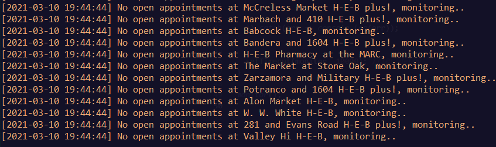
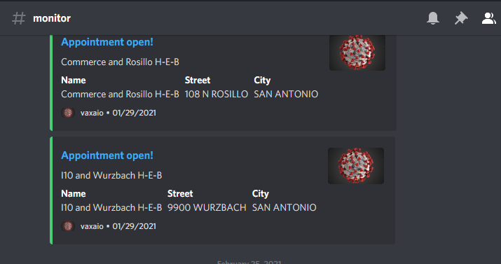
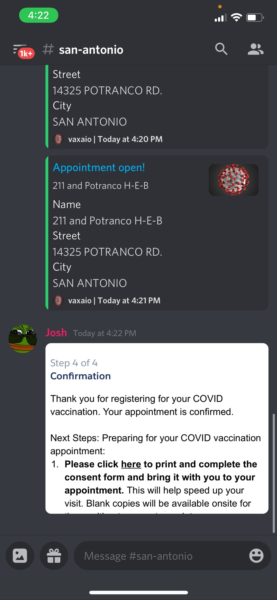

# HEB Vaccine appointment monitor

## Setup

1) Install node.js https://nodejs.org/en/ 
2) Download ZIP of this repository (or clone it)
3) CD into the directory via command prompt or terminal and run
   `npm install`.
4) Edit `config.json` to your discord bot token and webhook. https://discordjs.guide/preparations/setting-up-a-bot-application.html#creating-your-bot. This will allow you to receive notifications via Discord when an appointment is open. Create a bot and add it to your Discord server, then pick a channel and copy its webhook URL.  
5) Run `node vaccine`. 

## Configuration
In `vaccine.js` change `SAN ANTONIO` to any city that you would like to monitor for.
You can also change the timeout in ms from 10s to anything of your choosing.  

## 

## It works!

